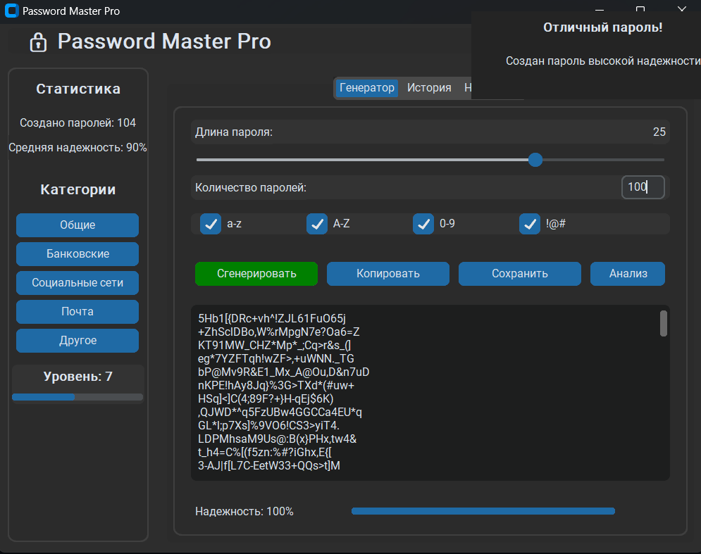
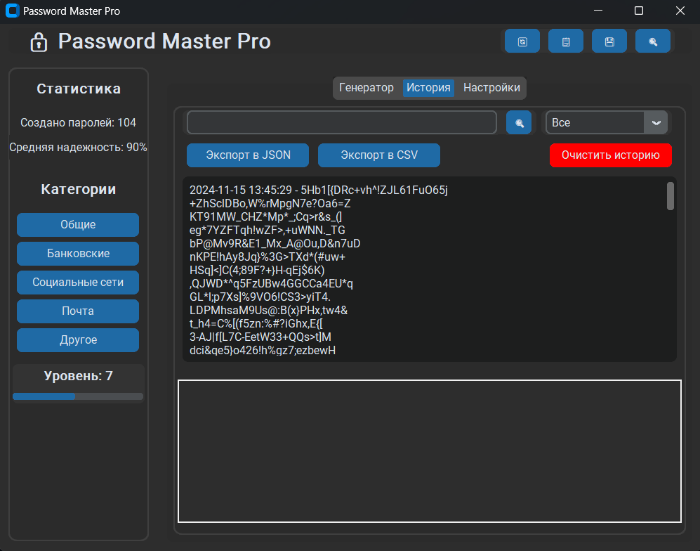
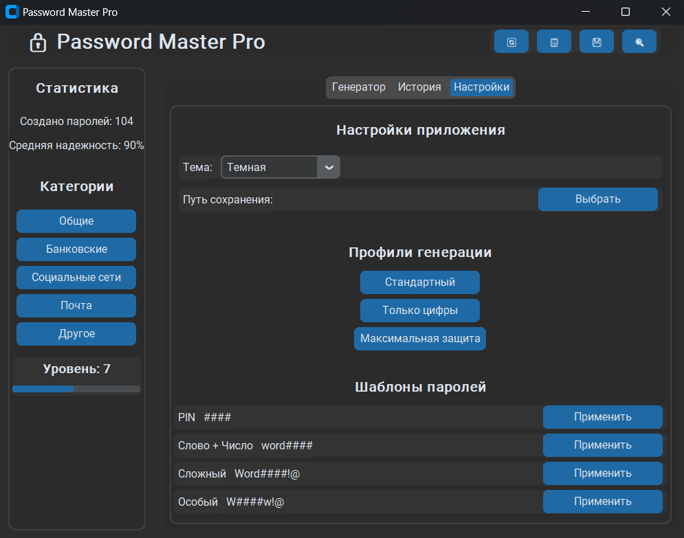

# Password Master Pro 🔒

Password Master Pro - это современный генератор паролей с расширенным функционалом, написанный на Python с использованием CustomTkinter.

## Возможности ✨

- **Гибкая генерация паролей**
  - Настраиваемая длина (8-32 символа)
  - Выбор типов символов (строчные, заглавные, цифры, спецсимволы)
  - Множественная генерация паролей
  - Шаблоны паролей

- **Анализ безопасности**
  - Оценка надежности пароля
  - Визуальный индикатор силы пароля
  - Подробный анализ составляющих пароля

- **Управление паролями**
  - Сохранение паролей по категориям
  - История генерации
  - Экспорт в JSON/CSV
  - Поиск и фильтрация

- **Геймификация**
  - Система уровней и опыта
  - Достижения
  - Статистика использования

- **Удобный интерфейс**
  - Темная/светлая тема
  - Анимированные элементы
  - Всплывающие подсказки
  - Горячие клавиши

## Установка 🚀

1. Клонируйте репозиторий:
   `git clone https://github.com/SomeMedic/pass-gen-ui.git`
2. Установите зависимости:
   `pip install customtkinter pyperclip`
3. Запустите приложение:
   `python pass_gen.py`

## Скриншоты 📸

### Главное окно

*Основной интерфейс генератора паролей*

### История паролей

*Вкладка истории с поиском и фильтрацией*

### Настройки

*Настройки приложения и профили генерации*

## Требования 📋

- Python 3.7+
- customtkinter
- pyperclip

## Горячие клавиши ⌨️

- `Ctrl + G` - Генерация пароля
- `Ctrl + C` - Копирование пароля
- `Ctrl + S` - Сохранение пароля
- `Ctrl + A` - Анализ пароля
- `Ctrl + F` - Поиск по истории

## Достижения 🏆

- **Новичок** - Создан первый пароль
- **Мастер** - Создано 100 паролей
- **Защитник** - Создан пароль максимальной надежности
- **Коллекционер** - Использованы все категории

## Категории паролей 📁

- Общие
- Банковские
- Социальные сети
- Почта
- Другое

## Профили генерации 📊

- **Стандартный** - сбалансированный пароль (12 символов)
- **Только цифры** - PIN-код (8 символов)
- **Максимальная защита** - сложный пароль (32 символа)

## Экспорт данных 💾

Поддерживается экспорт истории паролей в:
- JSON формат
- CSV формат

## Безопасность 🛡️

- Пароли не хранятся в открытом виде
- Локальное хранение данных
- Анализ на предмет утечек

## Вклад в проект 🤝

Приветствуются pull request'ы. Для крупных изменений, пожалуйста, сначала создайте issue для обсуждения предлагаемых изменений.

## Лицензия 📄

[MIT](https://choosealicense.com/licenses/mit/)

## Автор ✍️

 SomeMedic - [GitHub](https://github.com/SomeMedic)

---

**Password Master Pro** - Безопасность начинается с надежного пароля! 🔐
